## Improving Diagnosis Accuracy in Alzheimer’s Disease Patients: Drugs, Supplements, and Tau Protein Levels Are Important Predictors

Final Project Report for AC209a - Introduction to Data Science

Official Group #46: Carlo Amadei, Hsiang Hsu, Rebecca Stern, Thomas Hsueh

### TODO1: *"Finding the smallest and least expensive feature subset is important" - AC209 Guidlines

### Table of Content
- Problem statement and motivation
- Introduction and description of the data
- Literature review / related work
- Modeling approach and project trajectory
- Results, conclusions and future work
- Reference
- Appendix

### 1. PROBLEM STATEMENT AND MOTIVATION
Alzheimer’s Disease (AD) is a degenerative brain disease and the most common cause of dementia, and AD rates are increasing annually.[1] As of 2006, the global prevalence of AD was 26.6 million, and this figure is expected to increase four-fold by 2050.[2] In the United States in 2016, AD was the sixth leading cause of death.[3] From 2000-2013, deaths from AD increased 71% – this rise was larger than the increase in deaths from stroke (+23%) and heart disease (+14%) during the same time period.
<br />

<p align="center">
  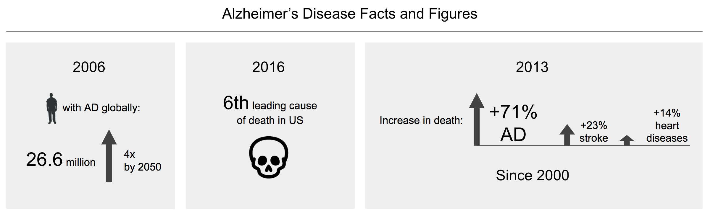
</p>

Given the debilitating nature of AD, the widespread and rising prevalence of this disease, and the increasing lifespan of human population, efforts to mitigate the incidence and damaged caused by AD in the future are imperative. A crucial step toward achieving this end is to understand the risk factors associated with AD. However, such predictive features are currently not well constrained. According to the U.S. 2017 Alzheimer’s Disease Facts and Figures [4]:

```markdown
“Although the research that followed has revealed a great deal about Alzheimer’s, much is 
yet to be discovered about the precise biological changes that cause the disease, why it 
progresses more quickly in some than in others, and how the disease can be prevented, 
slowed or stopped.”  
```

__The clinical challenge in diagnosing AD arises because early forms of the disease do not present motor, sensory, or coordination deficits, and laboratory tests are not determinative.[5]__ In addition, Mild Cognitive Impairment (MCI) is associated with AD, but more research is needed to improve accuracy of diagnostics that distinguish between amnestic MCI and prodromal AD.[6,7,8] Methods that improve accurate identification of early forms of AD, which do not present with cognitive symptoms, are an important component of clinical and research efforts to better characterize the causes and risks associated with this devastating progressive disease. 
<br />

Machine learning algorithms and statistical modeling offer a potential solution to offset the challenge in diagnosing early AD: by leveraging multiple data sources and combining information on neuropsychological, genetic, and biomarker indicators, among others, statistical models are a promising tool to enhance clinical detection of early AD. __In this project, we optimize predictive models for the diagnosis of AD pathologies using a set of baseline features, and we improve the model performance by incorporating additional variables related to patient medications and biomarkers.__ Specifically, we investigate the relationship between AD diagnosis and taking certain medications (i.e., Calcium supplements, Vitamin D supplements, blood-thinning medications, cholesterol-lowering drugs). We also evaluate the importance of two cerebrospinal fluid (CSF) biomarkers, tau (tau) and amyloid-Beta (Aβ), in diagnosing AD, as the relative role of these two biomarkers in AD remains a contentious issue in the academic community.[9,10] __Our hypothesis are as follows:__
__1. The diagnosis of early AD can be improved by considering features related to whether a patient takes certain medications (calcium, vitamin D, blood thinners, and cholesterol-lowering drugs).
2. CSF-tau is a stronger predictor than Aβ for AD diagnosis.__
<br />

The modeling approach we design could serve as a tool for clinicians to improve diagnosis of AD, as well as a springboard for future research related to AD and other neurodegenerative diseases.[11] __We contacted Sally Temple, Ph.D., a renowned neuroscientist specializing in neurodegenerative disease and co-founder of the Regenerative Research Foundation, who offered her insights related to our project objectives:__

```markdown
“It is essential to improve identification of signs of AD onset, because as drugs are
developed, early intervention will be an important treatment goal.”
```
<br />
 

### 2. INTRODUCTION AND DESCRIPTION OF THE DATA 
__We acquired our dataset from the Alzheimer’s Disease Neuroimaging Initiative (ADNI).[12]__ The baseline statistical model that we develop is constructed using the ADNIMERGE.csv dataset from ADNI, which contains select variables related to clinical, genetic, neuropsychological and imaging results for the participants in ADNI. All phases of ADNI are represented in ADNIMERGE (e.g., ADNI1, ADNI2, ADNIGO). To maintain consistency across our analyses and manageability of the data, and to ensure that we can select only one observation for each patient effectively, we select only the patients who participated in the ADNI2 phase of the Initiative, representing a cohort size of approximately 800 patients. In the ADNI2 observations, each row corresponds to an exam of a patient (“RID”, the patient identifier), and specific visit; multiple rows can refer to the same patient for different visits. A thorough description of the ADNI cohort demographics is available online[13]; in brief, the ADNI2 participants are from North America, aged 55-90, and ethnicities are represented in the study. The visit code column (VISCODE) allows us to identify baseline visit (‘bl’) predictors and predictors that refer to later visits. There are 94 columns in the baseline dataset, the majority of which correspond to independent variables that could be assessed at each exam. 
<br />

There are two diagnosis features, DX and DX_bl, which correspond to diagnosis at each visit and at a patient’s first visit, or baseline visit. All diagnoses entries correspond to one of five categories: Cognitively Normal (CN), Significant Subjective Memory Concern (SMC), Early Mildly Cognitively Impaired (EMCI), Late Mildly Cognitively Impaired (LMCI, or classic MCI), and Alzheimer’s Disease (AD).[14] We combine the EMCI and LMCI diagnostic classes into a single class, Mild Cognitive Impairment (MCI); an auxiliary benefit of doing this is it facilitates the extension of our model for future analyses that might include ADNI1 data, which employs only a single MCI category. We combine CN and SMC into one category, as SMC patients qualify as being “cognitively normal,” as illustrated below. For detailed treatment on our handling of the diagnosis feature as a response variable, please see the discussion in Section 4 titled, “Choice of Response Variable.”
<br />

<p align="center">
  
</p>

#### Supplemental features added to the baseline data
__In addition to the ADNI2 entries within ADNIMERGE.csv, we incorporate two additional datsets:__

1. __Data on patients’ medications using the ADNI dataset__: `ADMCPATIENTDRUGCLASSES_20170512.csv`). We construct four new features, or predictors, for AD diagnosis that are comprised of components within the drug dataset that qualify as one of our four categories for analysis: calcium supplements, vitamin D supplements, blood-thinning drugs, and cholesterol-lowering drugs. For a complete list of specific drug and supplement names, please see Appendix F. Importantly, taking any of these medications does not disqualify a patient from participating as part of the ADNI cohort.[15] 

2. __Data on patients’ cerebrospinal fluid (CSF) biomarker levels of amyloid-beta (Aβ) and tau (TAU and P-TAU)__ using the ADNI dataset, `UPENNbiomk9041917.csv`. This data was produced by the ADNI Biomarker Core Laboratory, which is directed by John Trojanowski, M.D. and co-directed by Leslie Shaw, Ph.D. at the University of Pennsylvania.

For both sets of supplemental data, we selected only the entries that correspond to the ADNI2 phase. From this, we constructed features columns that include the patient ID (RID), visit code (ultimately selecting only VISCODE==‘bl’), and the additional predictive features as described in (1) and (2) above. Retaining RID and VISCODE allowed us to merge this supplemental medication feature dataset with the preexisting baseline model dataset constructed from ADNIMERGE.csv. We did not include any other observation-identifying information (e.g., EXAMDATE, SITE) or other predictors besides those described above.
<br />

A flowchart illustrating the aforementioned dataset selection and integration is provided below:
<br />

<p align="center">
  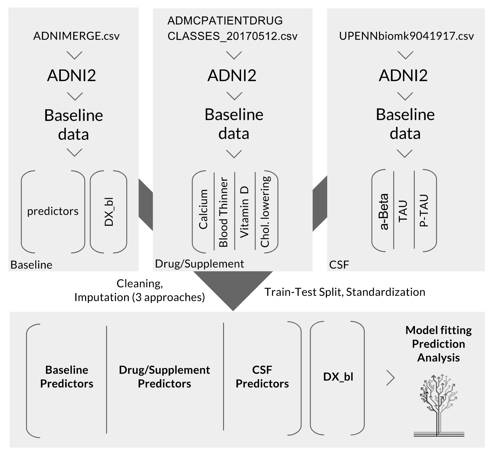
</p>
<br /><br />

### 3. LITERATURE REVIEW/RELATED WORK
Previous research has attempted to identify correlations between age-related cognitive decline and components of patients’ dietary and medical history. One publication found that Vitamin K antagonists increase cognitive impairment.[16] Other efforts have focused on the role of diuretics and nutritional supplements in developing dementia.[17] Additionally, some studies addressed the role of nutritional interventions (vitamin B12, B6, and E; omega-3 fatty acids; flavanol) and non-specific pharmacological interventions (NSAIDs, hormone-replacement therapy, Ginkgo biloba).[18] Three studies assessed the relationship between blood-thinners and AD.[19,20,21] __Importantly, none of the aforementioned works used the ADNI dataset to analyze the trends.__ However, a few studies have used the ADNI database specifically to explore relationships between AD and patient medications. One study of ADNI data found an association between non-steroidal anti-inflammatory drugs (NSAIDs) and improved cognition.[22] Another paper presented trends about which groups of patients in the ADNI dataset (e.g., grouped by educational level, race) were more likely to receive medications for treating AD symptoms.[23] 
<br />

According to Galvin (2012), “Combination of interventions, such as non-pharmacologic treatments, pharmacotherapy, and medical foods, with complementary mechanisms of action may provide a rational approach that may result in maximum preservation of cognitive function in patients with AD.”[24] __Despite the promising nature of improving diagnostic accuracy of AD using medication features, few studies using ADNI have considered the medications that we investigate: calcium and vitamin D supplements, blood-thinning drugs, and cholesterol-lowering drugs. Our paper aims to explore these features and, hopefully, help contribute to this gap in the literature.__
<br />

In addition to patient medications as potential predictors for AD, we also explore the the association of CSF biomarkers t-tau and Aβ with AD diagnosis at baseline visit (DX_bl). Both tau and Aβ levels reflect the accumulation of peptides in the brain (tau aggregates in tangles that are inside neurons, and Aβ accumulates in plaques outside neurons).[25] Accumulation in plaques and tangles are both closely tied to cognitive decline and identified as hallmark indicators of AD.[26,27] Previous studies have hailed Aβ as the “cardinal” feature of AD, which spurred therapies targeting the mechanisms of clearance and production of this peptide.[28,29,30] However, recent research indicates that the intracellular peptide tau may also play a significant role.[31] __The now decades-long “amyloid-tau debate” persists today, and resolution is needed to determine the true driver of AD symptoms.[32]__
<br />

Statistical models could aid efforts to resolve the debate about Aβ and tau, and direct clinical efforts toward therapies that target the more significant peptide. Numerous studies have been published that use the ADNI database to generate predictive models for the diagnosis and prognosis of AD with features related to tau and Aβ; however, __few studies have explicitly addressed the relative importance of t-tau and Aβ in absolute terms (i.e., excluding the temporal evolution of levels in progression of AD).[33-36]__:

1. One study explored the role of Aβ and tau proteins in the conversion from MCI to AD, however the methods involved removing predictors that contain missing values.[37] __It is hoped that our model with more elaborate imputation methods could improve upon this previous work.__

2. Another study explored the impact of CSF p-tau levels in the progression rate of AD, where only stepwise discriminant analysis is used for statistical analysis of predictor covariance.[38] Our model uses a wide range of statistical models and examines three different CSF tau peptides levels (p-tau, t-tau, and Aβ) so __hopefully we are able to provide a more thorough examination of the relationship between CSF peptide levels and AD diagnosis.__

3. Yet another study performed the largest genome-wide association study (GWAS) of CSF tau levels published before 2013, where three novel genome-wide significant loci for CSF tau and p-tau were identified that show strong association with risk for AD.[39] Linear regression was used for modeling single nucleotide polymorphism (SNP) for association with CSF biomarker levels. __It is our hope to use more complex predictive modeling techniques to unravel the association of CSF protein levels with risk/diagnosis of AD in the same ADNI dataset without delving into genetic analysis, which has a potential benefit of achieving a simpler yet powerful approach for AD diagnosis.__

__Statistical analysis of which peptide, Aβ or tau, is more important in diagnosing AD could bolster support for these nascent efforts and increase momentum in the clinical community toward developing therapeutic tools to address abnormal tau aggregation. As a contribution to this effort, in our model we compare the relative importance of t-tau and Aβ for accurate diagnosis of AD.__
<br /><br />

### 4. MODELING APPROACH AND PROJECT TRAJECTORY 

#### Overview of Modeling Tools
__We examined 17 different statistical models in total__ to select the optimal algorithm for predicting AD at baseline. All models used were derived from scikit-learn (sklearn) packages and executed in Python. Our data exploration, modeling approach, and progressive improvements to the baseline model are detailed next. Some caveats and limitations of our approach are mentioned directly in the text that follows; a more detailed examination of these conditions is provided in Appendix G.
<br />

__To satisfy the requirement of CS209A, we have adopted the following three advance models:__
- __Elastic Net__: logistic regression with both L1 and L2 regularization.
- __Multi-Layer Perceptron (MLP)__ - the basic deep learning model proven to be universal approximation thanks to the non-linear activation in its hidden layer(s). The non-linear activation function we adapted is the sigmoid function, since ReLU and hyperbolic tangent is not suitable for classification task.
- __Perceptron with elastic net penalty__ - one input and one output layer of perceptrons without hidden layer but with L1 and L2 regularization.
<br />

The following shows the 17 adopted statistical models in a list and in a chart where algorithms are grouped according to the algorithmic families they belong to.
<br />

- Logistic Regression - One-vs-Rest
- Logistic Regression - Multinomial
- Linear Discriminant Analysis (LDA) 
- Quadratic Discriminant Analysis (QDA)
- k-Nearest Neighbour (KNN)
- Decision Tree
- Random Forest
- AdaBoosting
- Logistic Regression with PCA for dimension reduction
- Linear Support Vector Machine (SVM)
- RBF (Radial Basis Function) SVM
- Sigmoid SVM
- Elastic Nets - Logistic Regression with both L1 and L2 regularization
- Multi-layer Perceptron (MLP) Classifier
- Perceptron with elastic net penalty (both L1 and L2 regularization)
- Meta Model - Majority Vote
- Meta Model - Logistic Rgression

<p align="center">
  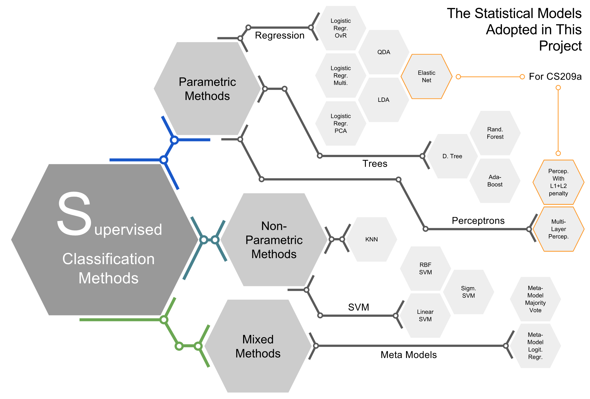
</p>

#### Choice of Response Variable
__The preliminary analysis led us to choose to use “DX_bl” as the response variable__. The “DX” column includes up to five entries for a given patient along the longitudinal course of their participation in the study. Our initial exploration revealed that models using “DX” might risk having in-sample correlation because there are multiple rows for a single person, all of which would be non-independent as a result. This is validated by our later analysis of the classification accuracy using “DX” as the response variable, which is unrealistically high (accuracy >95%). 
<br />

Given that “DX_bl” is the response variable, we chose only the rows and predictors that correspond to the baseline visit for each patient. As such, the results of our model could be used as a predictive tool for diagnosis (CN, MCI, or AD) at any given point in time, but they do not provide information about disease progression, or the longitudinal change in features for an individual patient. For the purposes of this analysis, a large part of our discussion focuses on the diagnosis of AD (DX_bl = AD), but the tools provided in our model could be extended to assess the relationship between the variables we include (their values in absolute terms) and the likelihood of being diagnosed into any of the three categories.
<br />

#### Data Cleaning, Reconciliation, and Imputation 
First, we consider just the observation related to ADNI2 and baseline (VISCODE == ‘bl’). Then, we substitute  -1, -4, and ‘Unknown’ as NaN, following the indication from [ADNI training presentation](https://adni.loni.usc.edu/wp-content/uploads/2012/08/slide_data_training_part2_reduced-size.pdf). We calculated the percent of each predictor column that contains missing values and we also assumed that the data was missing completely at random (MCAR), which is in line with previous studies.[40] We then discarded predictors that contain more than 40% of the missing data, and we sized down the dataframe by considering only the predictors referring to the baseline visit. In particular, we discarded variables that were connected to later visits, such as length of time incurred since the baseline visit. In order to do that we evaluate all the predictors to include in the model, drawing upon information from the preliminary model runs as well as qualitative information from the [ADNI Data FAQs](http://adni.loni.usc.edu/data-samples/data-faq/), [ADNI training presentation](https://adni.loni.usc.edu/wp-content/uploads/2012/08/slide_data_training_part2_reduced-size.pdf), and the [ADNI2 procedures manual](https://adni.loni.usc.edu/wp-content/uploads/2008/07/adni2-procedures-manual.pdf). Finally, we used hot-one encoding to expand categorical predictors (e.g. gender) and we encoded the response variable, DX_bl, with ordinal treatment such that the values CN, MCI, and AD are represented by integers 0, 1 and 2, respectively).[41]
<br />

__To explore possible covariates and/or collinearity, we used a covariance heatmap generated with Matplotlib__. A heatmap of some select baseline model predictors and DX_bl is provided below. As illustrated, some of the features exhibit very strong correlation to DX_bl. This was one of the first indications that __perhaps some features should not be treated as predictors, but rather proxies for the response variable, DX_bl__. In particular, __Clinical Dementia Rating (CDRSB_bl), Mini-Mental State Exam (MMSE_bl), and Rey Auditory Verbal Learning Test (RAVLT_learning_bl, RAVLT_forgetting_bl, RAVLT_perc_forgetting_bl, RAVLT_immediate_bl) raised these concerns__. It is interesting to note that RAVLT_forgetting_bl does not seem to discriminate well between the diagnostic classes, while RAVLT_learning does. In the next section, “Baseline Model: Selection, Optimization and Evaluation,” we further justify our decision to remove these three variables given that they are effectively a proxy for AD diagnosis.
<br />

<p align="center">
  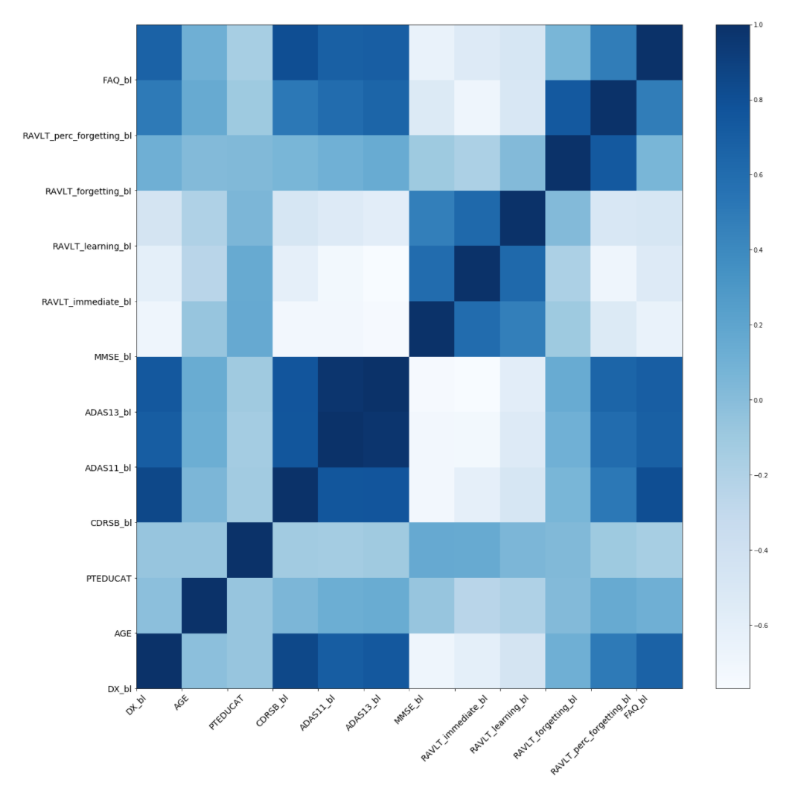
</p>

Below is a density plot of the relationship between MMSE_bl and the various diagnostic classes. Addition EDA analyses are provided in Appendix H.
<br />
<p align="center">
  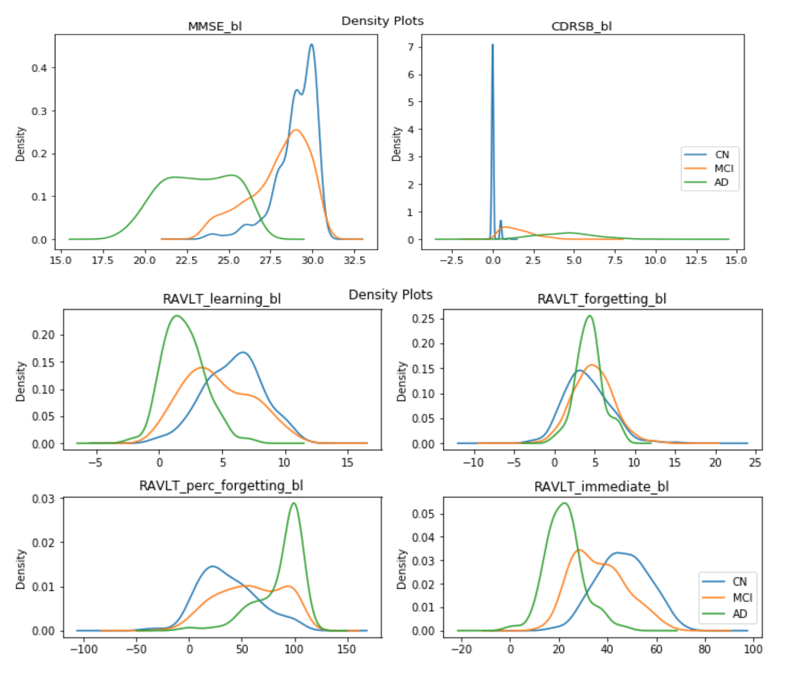
</p>

__After visualizing this strong correlation and researching the meaning of RAVLT, MMSE, and CDR from a conceptual standpoint, we decided to exclude these predictors from our baseline model__. This seems justified, given that these features are often considered to be a proxy for diagnosing Alzheimer’s Disease, and thus closely represent the response variable.
<br />

__After removing RAVLT, MMSE, and CDR-related features, we generate a new heatmap of the remaining features, shown next__. There is some expected collinearity between features (e.g., the two genders are anticorrelated), and there does not appear to be significant covariance that would be cause for exclusion of any of the remaining features. __Also of note is the heatmap reveals that being Hispanic and male is positively correlated with AD diagnosis in the baseline visit.__

<p align="center">
  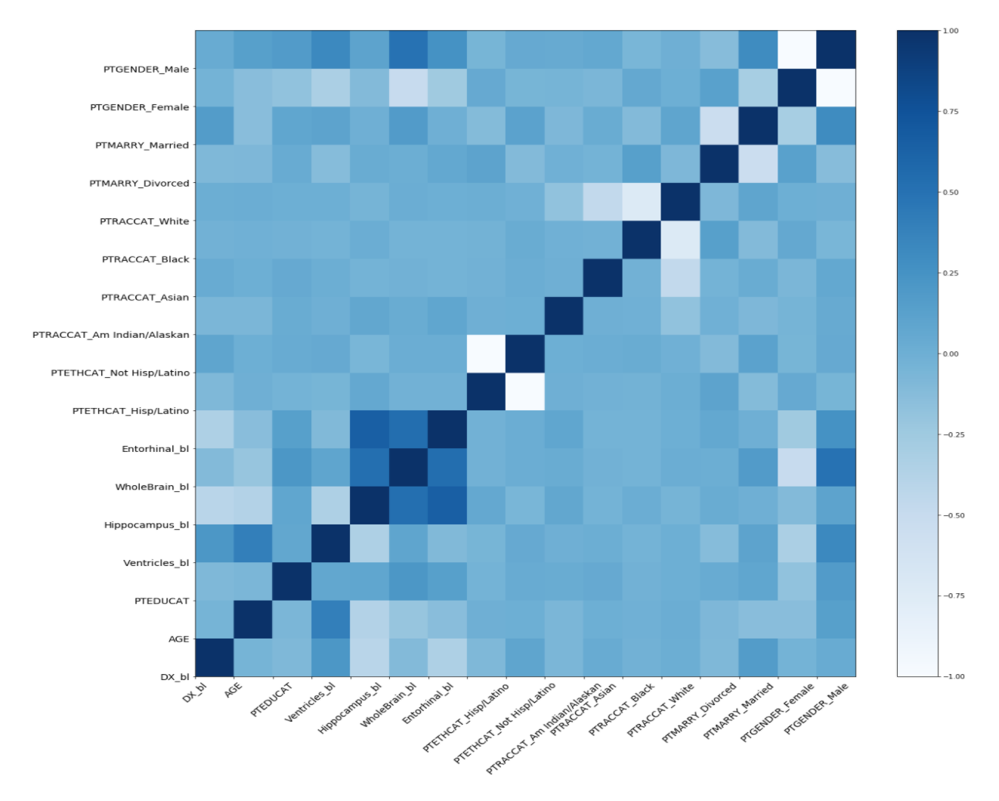
</p>

__To handle missing values__ in the features that were not already discarded, we considered three different approaches:
1. remove all missing values.
2. fill missing values with mean imputation.
3. impute missing values using linear regression.

__We chose to proceed with linear-regression-based imputation__, since it achieves high performance and does not result in a reduction of the AD class in as dramatic a way as when we remove all missing values, while mean-imputation performs worse and is theoretically making unrealistic, even destructive, assumption in the structural pattern among the data.
<br />

__We evaluated whether the dataset was imbalanced with respect to each diagnosis class at baseline.__ The ratio of the classes does not significantly change after pre-processing the data (remove missing values, imputing missing values), as illustrated in the figures below. While AD is smaller than the CN and MCI categories, the ratio between AD and the other classes is not less than 10%, so __we determine that the class does not suffer from underrepresentation__.
<br />

<p align="center">
  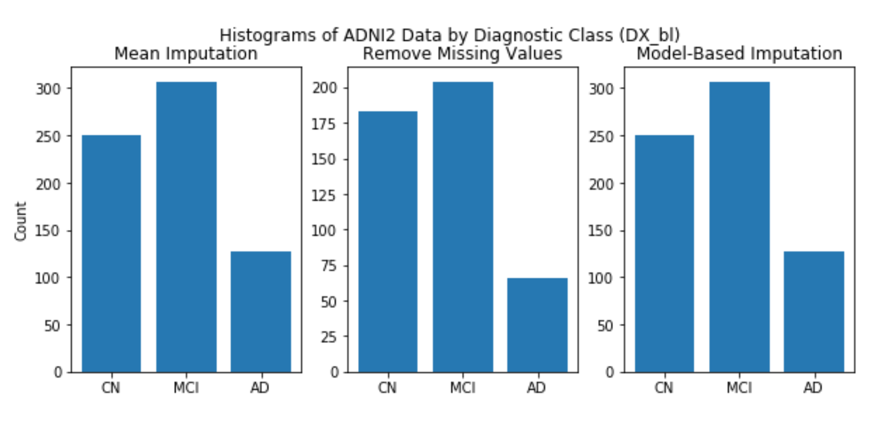
</p>

Given that the symptomatic presentation of AD does not comprise any conclusive genetic, biomarker, or other clinical variable, this means that many predictors must be combined together to improve the predictive power of our model. As such, __we chose to perform the imputation on the entire dataset before splitting it into test and train sets; this allowed us to include as many observations as possible in the imputation__. Taking the dataset with model-based imputation, we then split it into train and test sets by 75% and 25%, respectively. Finally, __we standardized the continuous predictors. We chose standardization over normalization because the former is less sensitive to outliers__.
<br />

In the next sub-section, we describe our process of building the baseline model with the predictors derived from ADNIMERGE.csv, and then improving the baseline model with predictors from ADMCPATIENTDRUGCLASSES_20170512.csv and UPENNbiomk9041917.csv. 
<br /><br />

#### Baseline Model: Selection, Optimization and Evaluation
Below we provide a bar chart of the performance on the test and training sets using the 17 statistical models fitted to the baseline ADNIMERGE data.
<br />

<p align="center">
  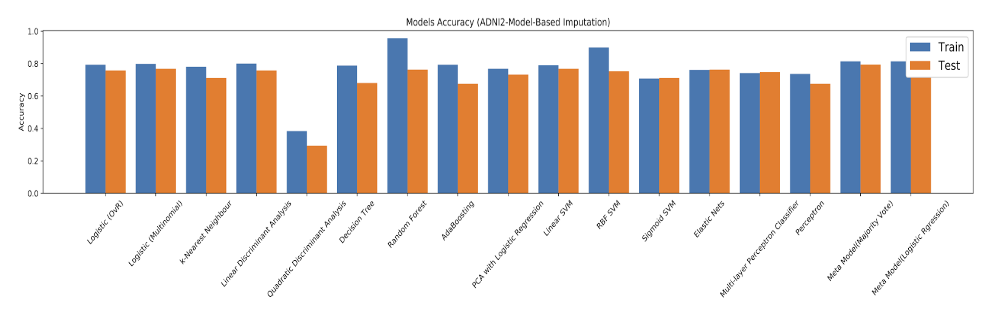
</p>

While several of the models performed acceptably well on the test set using the baseline data (accuracies ~60%-72%), we analyze two of them in-depth for the baseline dataset and baseline+additional features related to medications and biomarkers. The first model we focus on is __multinomial logistic regression model with cross-validation__ – sklearn’s LogisticRegressionCV – which not only generated a __high preliminary accuracy on the test set (76%)__, but also provides easily interpretable results with respect to the coefficients of the features, as the __beta values__ can be used directly to interpret the direction and strength of the correlation between each feature and DX_bl. Details of the coefficient analysis are provided in a later section of this report. In a similar way, the __RandomForestClassifier__ from Sklearn allows for analysis of __individual feature strengths__ using the feature_importances_tool. This gives us an indication of the gini importance (or mean decrease impurity) associated with each random forest model predictor; that is, it provides the average over all trees in the ensemble of the total decrease in impurity at the node (weighted by probability of reaching the node, or the proportion of samples that reach the node) that results from a given feature. As such, if the feature_importances_ value is low, then the feature is not important.
<br />

In addition, __we noticed that the test accuracy was exceptionally high when we included certain predictors__. After ranking the predictors by their influence on the performance of the model, we found that these predictors were the most influential on the accuracy of the baseline model: __MMSE_bl, RAVLT_bl, and CDRSB_bl__. In addition to the heatmap presented previously, this was the primary motivation for removing these three predictors from the baseline model. __Without these three features, our test set accuracy using multiple LRCV was reasonable at 0.77__. The classification accuracy score (percent of correct classification of DX_bl) was used to evaluate the models. __We decide not to use the area under the receiver operating characteristic (ROC) curve (AUC)__ because the dataset is not biased toward one class or another and the response variable is multi-class, so accuracy score is a sufficient metric for evaluating our model performance. 
<br />

Below is a table of the dataset size for the baseline features and baseline + additional features, before and after pre-processing.
<br />

<p align="center">
  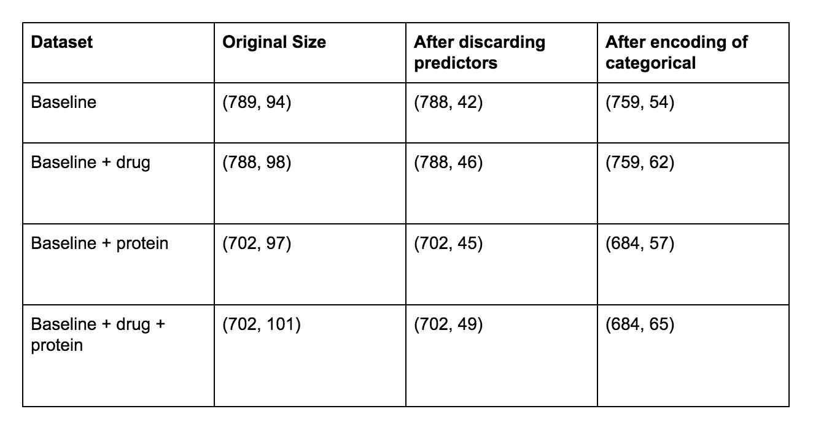
</p>
<br />

#### Improvements to the Baseline Model: Medications and Biomarkers
We next built upon the baseline model by incorporating the additional predictors for calcium supplements, vitamin D supplements, cholesterol-lowering drugs, blood-thinning drugs, TAU levels, P-TAU, and ABETA (Aβ) levels. We performed preliminary EDA on the additional predictors to ensure that these variables are appropriate for use. Below is a heatmap illustrating the covariance between the additional predictors and the response variable, DX_bl. 
<br />

<p align="center">
  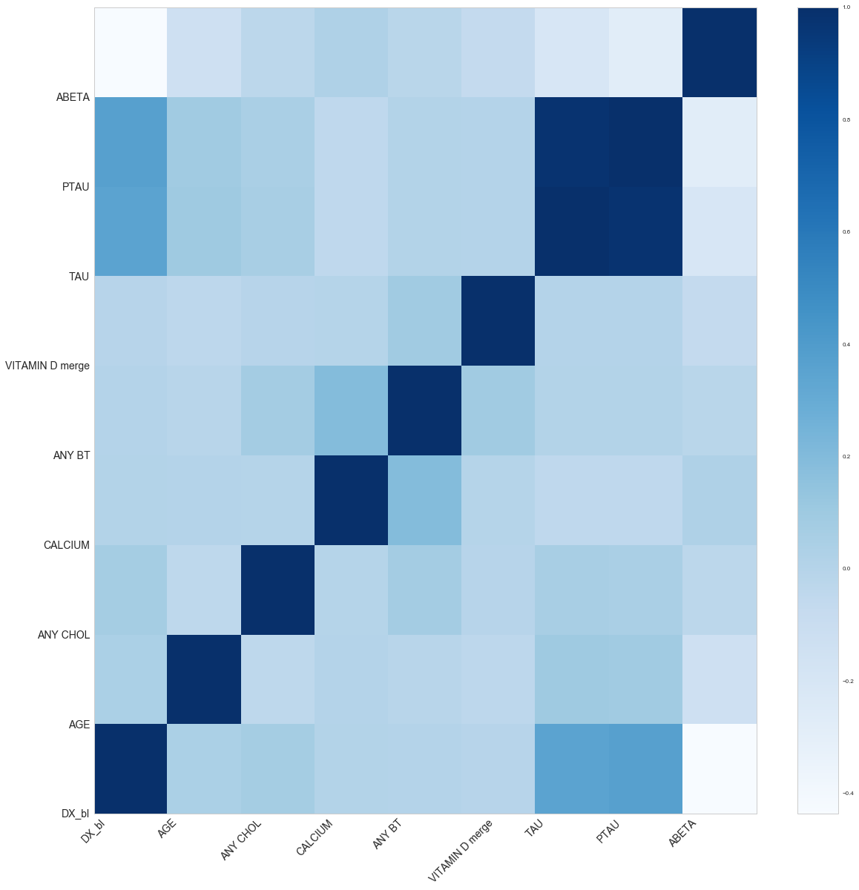
</p>

__The total number of patients that take medication is circa 5% and this sample is dominated by the patients assuming blood thinner (circa 3.5%)__.
<br />

In the section that follows, we review some of the key findings of our models using the merged baseline, medication, and biomarker predictors. Detailed discussion of the predictor coefficients and feature importances are also provided for the multiple LRCV and random forest classifier models, respectively.
<br /><br />


### 5. RESULTS, CONCLUSIONS AND FUTURE WORK

#### Results
In this section, we present the key findings from our models and provide tables of all of the models analyzed for each predictor scenario (baseline, baseline+medication, baseline+biomarker, and baseline+medication+biomarker). For the purposes of the discussion, we focus on the logistic regression with cross validation (LRCV) and random forest (RF) model results. In brief, our ‘baseline’ model predicts DX_bl on the test set with an accuracy of 0.768 and 0.763 for LRCV and RF, respectively. When we add additional features about patient medications, the performance improves for the LRCV model, with a test accuracy for the ‘baseline+medication’ model of 0.778. For the RF model, the drug features do not appear to improve test performance. The biomarker features do not seem to improve the model results; for the ‘baseline+biomarker’ model, the test accuracy is 0.742 for both LRCV and RF. Likewise, including all predictors (baseline+medication+biomarker) lowers the test accuracy in the logistic regression model to 0.736. The RF accuracy slightly improves with this full predictor set, with a test accuracy of 0.770. Analysis of the significance of specific features using the coefficients of the LRCV model reveals that medications appear to be more helpful than biomarkers as predictors; none of the biomarkers (ABETA, TAU, P-TAU) are significant in the baseline+medication+biomarker model.
<br />

Below are a few overall points about the features in the baseline and baseline+medication+biomarker models. We see that age and many of the genetic predictors included in ADNIMERGE are significant. The biomarkers do not exhibit a significant impact on the likelihood of AD. Our investigation into the medications shows that cholesterol-lowering drugs and blood thinners are both significant predictors in our updated model. Further details about the features are below.
<br />
Baseline Model:
1. The Predictors that are most important in the prediction of DX_bl are: `'AGE', 'FAQ_bl', 'MOCA_bl', 'APOE4_0.0'`
2. The Predictors that are Positively Correlated to AD are: `'AGE', 'MOCA_bl', 'APOE4_0.0'`
3. The Predictors that are Negatively Correlated to AD are: `'FAQ_bl'`

Baseline+Medication+Biomarker Model:
<br />
1. The Predictors that are important in the prediction of DX_bl are: `'AGE', 'ADAS11_bl', 'ADAS13_bl', 'FAQ_bl', 'Hippocampus_bl', 'MOCA_bl', 'EcogPtMem_bl', 'EcogPtTotal_bl', 'EcogSPMem_bl', 'EcogSPVisspat_bl', 'EcogSPTotal_bl', 'PTRACCAT_White', 'ANY BT_1', 'ANY CHOL_1'`
2. The Predictors that are Positively Correlated to AD are: `'AGE', 'Hippocampus_bl', 'MOCA_bl'`
3. The Predictors that are Negatively Correlated to AD are: `'ADAS11_bl', 'ADAS13_bl', 'FAQ_bl', 'EcogPtMem_bl', 'EcogPtTotal_bl', 'EcogSPMem_bl', 'EcogSPVisspat_bl', 'EcogSPTotal_bl', 'PTRACCAT_White', 'ANY BT_1', 'ANY CHOL_1'`

It is important to note that while these results and the details that follow reveal interesting findings about potential interactions between patient medications and the likelihood of AD diagnosis, the results do not determine causality in the relationship. Nonetheless, our results are valuable because they provide information that could motivate future research efforts to understand the mechanisms that underlie the relationships.
<br />

#### Baseline Model Results
Below are details of all models’ accuracy on the train and test set using the ‘baseline’ feature set.
<p align="center">
  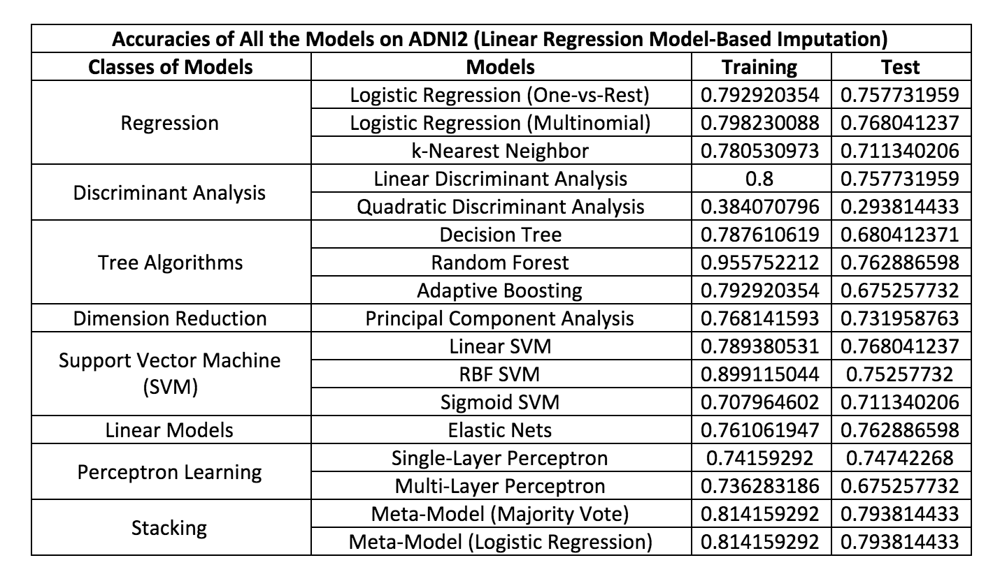
</p>
<br />

#### Baseline + Additional Medication Predictor Model Results
<p align="center">
  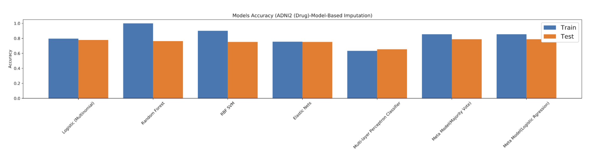
</p>

Overall, including the medication features generates 1 ~ 2% improvement in AD diagnosis accuracy. We find that taking calcium and vitamin D supplements does not have a significant effect on the diagnosis class at baseline visit. However, taking blood thinners and cholesterol-lowering drugs are both significant features in the model; they are negatively correlated with AD diagnosis (e.g., __taking blood-thinners appears to reduce the risk of Alzheimer’s Disease, which confirms the aforementioned literature review that reveals blood-thinners reduce dementia risk).[18]__ Our finding that taking cholesterol-lowering drugs is associated with a lower likelihood of AD diagnosis is particularly notable; __to the best of our knowledge, no studies using the ADNI dataset have addressed this interaction before. We hope that these results will motivate subsequent clinical research to investigate the relationships that we find.__
<br />

A table of accuracies using the baseline+medication model follows: 

<p align="center">
  
</p>

As a final analysis, we also explored a hypothetical model that used only the medications as predictors (i.e., excluding all other ADNIMERGE.csv predictors from the baseline model). We found that, when considering only medications, blood thinners and cholesterol have a significant influence on predicting the MCI class of DX_bl. Calcium was positively correlated with MCI. However, for the AD class in this 3-predictor model, we find that none of the medications are significant predictors. This implies that __including medications as a supplemental feature in the baseline model is the best approach, and that these features may be particularly important for diagnosing prodromal stages of AD.__
<br />

#### Baseline+Biomarker Model Results

<p align="center">
  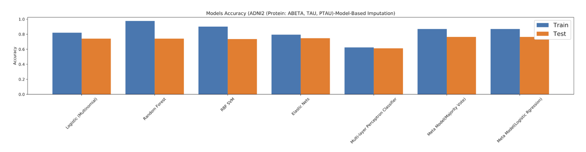
</p>

<p align="center">
  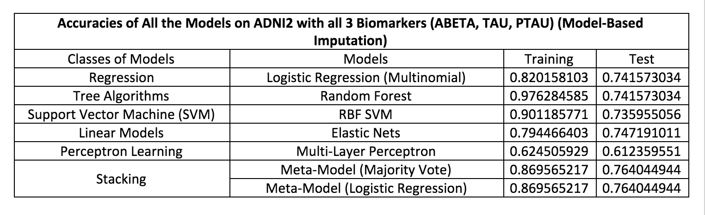
</p>


#### Comparison between CSF TAU and ABETA
Amyloid-Beta:

<p align="center">
  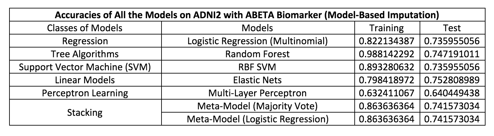
</p>

__In line with the literature about the “amyloid-tau debate” mentioned previously, we see that the performance accuracy changes by about the same amount when we incorporate tau and amyloid-beta features individually to the baseline model.__ Interestingly, the RF model performs better with Aβ than with tau, and the LRCV model performs better with tau. Importantly, both of these features do not improve the test accuracy above the baseline model, which exhibited a test accuracy of 0.77. 
<br />

#### Baseline+Medication+Biomarker Model Results
<p align="center">
  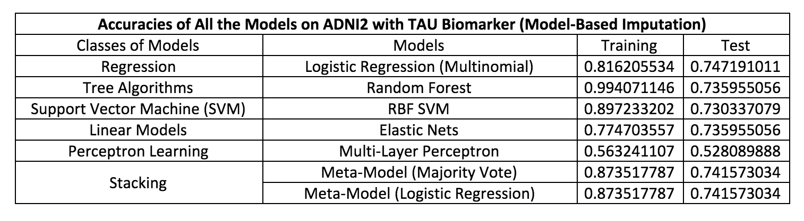
</p>

<p align="center">
  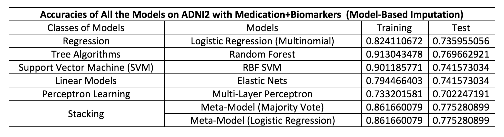
</p>

As previously discussed and illustrated in the table above, the baseline model performance is higher than the model that integrates biomarker and medication predictors. The decrease in performance could be a manifestation of the fact that we are overfitting to the training set (exhibited by high train accuracies), or perhaps there is a negative interference between the baseline features and the biomarker, such that it reduces the performance when they are combined in a single model. In any event, __the fact that the baseline and baseline+drug models perform better than the baseline+drug+medication model is reason to support the use of a simpler model over one with more features, particularly those that are computationally expensive (e.g., biomarker features are likely also more costly and time-consuming to investigate from a clinical standpoint).__
<br />

#### Conclusions
Accurate and early diagnosis of AD represents is crucial for mitigating the devastation caused by this disease, which has been increasing in prevalence.[44] Statistical models can serve as a tool to improve clinical diagnosis early AD and offer new insights for research about this devastating progressive illness, as well as other neurodegenerative diseases. We present a model using baseline features from the Alzheimer’s Disease Neuroimaging Initiative (ADNI) Phase 2 cohort using the ADNIMERGE.csv, and we expand the baseline model by accounting for features related to a patient’s current medications – calcium and vitamin D supplements, blood-thinning drugs, and cholesterol-lowering drugs – and a patient’s CSF total-tau, phosphorylated-tau and amyloid-β levels. Our results indicate that patients’ age, race, Everyday Cognition Memory Domain test scores (EcogSPMem), hippocampal volume, and Montreal Cognitive Assessment (MoCA) are associated with a higher likelihood of being diagnosed with AD based on our analysis of the baseline visit data. In addition, our results reveal that neither of the CSF biomarkers, tau or Aβ, are significant predictors of DX_bl when added to the baseline model. The fact that we find an association between blood-thinning (ANY BT) and cholesterol-lowering (ANY CHOL) drugs and AD diagnosis is significant because these two features are, we imagine, relatively easily translated from the clinic. Patient medical history should be readily attainable, cheap to reproduce, and, given the increasingly mainstream use of electronic health records, a potentially untapped resource for improving diagnosis of early stage AD. One might speculate that supplementing clinical diagnoses with information using a statistical model that includes features for patients’ medications could improve diagnostic accuracy. Perhaps, more research should be directed toward identifying causal links between medications that affect cardiovascular systems and cholesterol levels, rather than toward resolving the decades-old “tau-amyloid debate.” Our improved model with medication features could ameliorate the challenge of diagnosing early stages of AD when other symptoms are less readily detectable, which continues to plague the clinical and research communities alike. 

#### Future Research
Our results reveal the potential for nutritional and medical history to serve as a supplemental feature for accurate AD diagnosis. In later work, we would like to explore the relationship between other medications – including Vitamin E supplements – and early AD diagnosis. The research community would benefit from an examination of the potential causal factors underlying the interaction between blood-thinning drugs and AD. In addition, further analysis of the relationship between cholesterol-lowering drugs and DX_bl using ADNIGO and ADNI1 would provide support for our novel findings. Another potential avenue will be to incorporate ADNI3 data, which follows patients for a further five years and concludes in 2022. ADNI3 is particularly relevant with respect to our findings about the relative insignificance of biomarker data as supplements to the ADNIMERGE predictors because one goal of ADNI3 is to use “tau PET imaging to determine how tau tangles are related to amyloid levels and to cognition.[45]” Finally, we encourage researchers to explore datasets other than ADNI and to report whether a similar relationship between cholesterol-lowering drugs and these AD diagnostic classes can be found, as this would further validate our findings.

#### Conflict of Interest
The authors of this report declare no conflict of interest.
<br />

#### Disclaimer
This website does not provide medical advice. The content of this website, such as graphics, images, text and all other materials, is provided for reference and educational purposes only. The content is not meant to be complete or exhaustive or to be applicable to any specific individual's medical condition.
<br />

#### Please see the Appendix for additional details mentioned in this report. 


### Reference
1.  Loewenstein D, et al. Relative frequencies of Alzheimer’s disease, Lewy body, vascular and frontotemporal dementia, and hippocampal sclerosis in the State of Florida Brain Bank. Alzheimer Dis Assoc Disord 2002;16(4):203-12
2.  Brookmeyer, R., Johnson, E., Ziegler-Graham, K., & Arrighi, H. M. (2007). Forecasting the global burden of Alzheimer’s disease. Alzheimer's & dementia, 3(3), 186-191.
3.  Alzheimer's Association. (2016). 2016 Alzheimer's disease facts and figures. Alzheimer's & Dementia, 12(4), 459-509.
4.  https://www.alz.org/documents_custom/2017-facts-and-figures.pdf
5.  McKhann, G., Drachman, D., Folstein, M., Katzman, R., Price, D., & Stadlan, E. M. (1984). Clinical diagnosis of Alzheimer's disease Report of the NINCDS‐ADRDA Work Group* under the auspices of Department of Health and Human Services Task Force on Alzheimer's Disease. Neurology, 34(7), 939-939.
6.  Dubois, B., & Albert, M. L. (2004). Amnestic MCI or prodromal Alzheimer's disease?. The Lancet Neurology, 3(4), 246-248.
7.  Trojanowski, J. Q., Vandeerstichele, H., Korecka, M., Clark, C. M., Aisen, P. S., Petersen, R. C., ... & Dean, R. (2010). Update on the biomarker core of the Alzheimer's Disease Neuroimaging Initiative subjects. Alzheimer's & Dementia, 6(3), 230-238.
8.  Britt III, W. G., Hansen, A. M., Bhaskerrao, S., Larsen, J. P., Petersen, F., Dickson, A., ... & Kirsch, W. M. (2011). Mild cognitive impairment: prodromal Alzheimer's disease or something else?. Journal of Alzheimer's Disease, 27(3), 543-551.
9.  Ittner, L. M., & Götz, J. (2011). Amyloid-β and tau—a toxic pas de deux in Alzheimer's disease. Nature Reviews Neuroscience, 12(2), 67-72.
10.  Tapiola, T., Alafuzoff, I., Herukka, S. K., Parkkinen, L., Hartikainen, P., Soininen, H., & Pirttilä, T. (2009). Cerebrospinal fluid β-amyloid 42 and tau proteins as biomarkers of Alzheimer-type pathologic changes in the brain. Archives of neurology, 66(3), 382-389.
11.  Wagner, J., Krauss, S., Shi, S., Ryazanov, S., Steffen, J., Miklitz, C., ... & Weckbecker, D. (2015). Reducing tau aggregates with anle138b delays disease progression in a mouse model of tauopathies. Acta neuropathologica, 130(5), 619-631.
12.  http://adni.loni.usc.edu/
13.  http://adni.loni.usc.edu/study-design/
14.  http://www.adni-info.org/Scientists/doc/ADNI2_Protocol_A3_17Oct2014_CLEAN.pdf
15.  https://adni.loni.usc.edu/wp-content/uploads/2008/07/adni2-procedures-manual.pdf
16.  Annweiler, C., Ferland, G., Barberger-Gateau, P., Brangier, A., Rolland, Y., & Beauchet, O. (2014). Vitamin K antagonists and cognitive impairment: results from a cross-sectional pilot study among geriatric patients. Journals of Gerontology Series A: Biomedical Sciences and Medical Sciences, 70(1), 97-101.
17.  DeBusk, R. M. (2000). Dietary supplements and cardiovascular disease. Current atherosclerosis reports, 2(6), 508-514.
18.  Andrieu, S., Coley, N., Lovestone, S., Aisen, P. S., & Vellas, B. (2015). Prevention of sporadic Alzheimer's disease: lessons learned from clinical trials and future directions. The Lancet Neurology, 14(9), 926-944.
19.  Peters, R., Beckett, N., Forette, F., Tuomilehto, J., Clarke, R., Ritchie, C., ... & Comsa, M. (2008). Incident dementia and blood pressure lowering in the Hypertension in the Very Elderly Trial cognitive function assessment (HYVET-COG): a double-blind, placebo controlled trial. The Lancet Neurology, 7(8), 683-689.
20.  Hajjar, I., Hart, M., Chen, Y. L., Mack, W., Milberg, W., Chui, H., & Lipsitz, L. (2012). Effect of antihypertensive therapy on cognitive function in early executive cognitive impairment: a double-blind randomized clinical trial. Archives of internal medicine, 172(5), 442-444.
21.  Collaborative, P. R. O. G. R. E. S. S., Neal, B., & MacMahon, S. (2003). Effects of blood pressure lowering with perindopril and indapamide therapy on dementia and cognitive decline in patients with cerebrovascular disease. Arch Intern Med, 163, 1069-75.
22.  Doan, L., Choi, D., Kline, R., & Alzheimers Disease Neuroimaging Initiative. (2017). Impact of analgesics on executive function and memory in the Alzheimer's Disease Neuroimaging Initiative Database. Scandinavian Journal of Pain.
23.  Epstein, N. U., Saykin, A. J., Risacher, S. L., Gao, S., & Farlow, M. R. (2010). Differences in medication use in the Alzheimer’s disease Neuroimaging initiative. Drugs & aging, 27(8), 677-686.
24.  Galvin, J. E. (2012). Optimizing diagnosis and management in mild-to-moderate Alzheimer’s disease. Neurodegener Dis Manag, 2(3): 291–304.
25.  Tiraboschi P, Hansen L, Thal L, Corey-Bloom J (2004). The importance of neuritic plaques and tangles to the development and evolution of AD. Neurology. 62 (11): 1984–9. 
26.  Tatebe, H., Kasai, T., Ohmichi, T., Kishi, Y., Kakeya, T., Waragai, M., ... & Tokuda, T. (2017). Quantification of plasma phosphorylated tau to use as a biomarker for brain Alzheimer pathology: pilot case-control studies including patients with Alzheimer’s disease and down syndrome. Molecular neurodegeneration, 12(1), 63.
27.  Schraen-Maschke, S., Sergeant, N., Dhaenens, C. M., Bombois, S., Deramecourt, V., Caillet-Boudin, M. L., ... & Buee, L. (2008). Tau as a biomarker of neurodegenerative diseases.
28.  Citron, M. (2010). Alzheimer's disease: strategies for disease modification. Nature reviews Drug discovery, 9(5), 387-398.
29.  Glenner, G. G. (1990). Alzheimer’s disease. In Biomedical Advances in Aging (pp. 51-62). Springer, Boston, MA. 
30.  Han, S. D., Gruhl, J., Beckett, L., Dodge, H. H., Stricker, N. H., Farias, S., ... & Alzheimer’s Disease Neuroimaging Initiative. (2012). Beta amyloid, tau, neuroimaging, and cognition: sequence modeling of biomarkers for Alzheimer’s disease. Brain imaging and behavior, 6(4), 610-620.
31.  Ittner, L. M., & Götz, J. (2011). Amyloid-β and tau—a toxic pas de deux in Alzheimer's disease. Nature Reviews Neuroscience, 12(2), 67-72.
32.  Underwood, E. (2016). Tau protein—not amyloid—may be key driver of Alzheimer’s symptoms. Science Magazine. Retrieved from: http://www.sciencemag.org/news/2016/05/tau-protein-not-amyloid-may-be-key-driver-alzheimer-s-symptoms
33.  Shaw, L. M., Vanderstichele, H., Knapik‐Czajka, M., Clark, C. M., Aisen, P. S., Petersen, R. C., ... & Dean, R. (2009). Cerebrospinal fluid biomarker signature in Alzheimer's disease neuroimaging initiative subjects. Annals of neurology, 65(4), 403-413.
34.  Jack, C. R., Knopman, D. S., Jagust, W. J., Petersen, R. C., Weiner, M. W., Aisen, P. S., ... & Lesnick, T. G. (2013). Tracking pathophysiological processes in Alzheimer's disease: an updated hypothetical model of dynamic biomarkers. The Lancet Neurology, 12(2), 207-216.
35.  Kim, S., Swaminathan, S., Shen, L., Risacher, S. L., Nho, K., Foroud, T., ... & Craig, D. W. (2011). Genome-wide association study of CSF biomarkers Aβ1-42, t-tau, and p-tau181p in the ADNI cohort. Neurology, 76(1), 69-79.
36.  http://www.adni-info.org/Scientists/ADNIScientistsHome/ADNIPublications.html
37.  Ewers, M., Walsh, C., Trojanowski, J. Q., Shaw, L. M., Petersen, R. C., Jack, C. R., ... & Vellas, B. (2012). Prediction of conversion from mild cognitive impairment to Alzheimer's disease dementia based upon biomarkers and neuropsychological test performance. Neurobiology of aging, 33(7), 1203-1214.
38.  Cruchaga, C., Kauwe, J. S., Mayo, K., Spiegel, N., Bertelsen, S., Nowotny, P., ... & Owen, M. M. (2010). SNPs associated with cerebrospinal fluid phospho-tau levels influence rate of decline in Alzheimer's disease. PLoS genetics, 6(9), e1001101.
39.  Cruchaga, C., Kauwe, J. S., Harari, O., Jin, S. C., Cai, Y., Karch, C. M., ... & Bertelsen, S. (2013). GWAS of cerebrospinal fluid tau levels identifies risk variants for Alzheimer’s disease. Neuron, 78(2), 256-268..
40.  Lo, R. Y., Jagust, W. J., Aisen, P., Jack, C. R., Toga, A. W., Beckett, L., ... & Thomas, R. G. (2012). Predicting missing biomarker data in a longitudinal study of Alzheimer disease. Neurology, 78(18), 1376-1382.
41.  Aisen, P., Petersen, R., Dononhue, M., & Weiner, M. (2015). ADNI 2 Clinical Core: Progress and Plans. Alzheimers Dement. 11(7): 734–739.
42.  Hornik, K., Stinchcombe, M., & White, H. (1989). Multilayer feedforward networks are universal approximators. Neural networks, 2(5), 359-366.
43.  Rasmussen, C. E., & Williams, C. K. (2006). Gaussian processes for machine learning (Vol. 1). Cambridge: MIT press.
44.  Khachaturian, Z. S. (1985). Diagnosis of Alzheimer's disease. Archives of neurology, 42(11), 1097-1105.
45.  Weiner, M. W., Veitch, D. P., Aisen, P. S., Beckett, L. A., Cairns, N. J., Green, R. C., ... & Petersen, R. C. (2017). The Alzheimer's Disease Neuroimaging Initiative 3: continued innovation for clinical trial improvement. Alzheimer's & dementia: the journal of the Alzheimer's Association, 13(5), 561-571.


### APPENDIX

#### Appendix A. Accuracies on baseline train and test set, missing values removed
For this preprocessing method, we find out that Random Forest has the highest accuracy in training set; however, according to the accuracy on test set, we think that there might be an overfitting, despite we have cross-validate the variables in it.
<br />

<p align="center">
  
</p>

#### Appendix B. Accuracy on baseline train and test set with missing values imputed 
Model-Based Imputation:
<p align="center">
  
</p>

Mean Imputation:
<p align="center">
  
</p>

#### Appendix C. Accuracies using baseline+medications, baseline+biomarker, and baseline+medication+biomarker datasets
Train and Test Accuracy, Baseline + Additional Medication Features

Train and Test Accuracy, Baseline + Biomarker Features

Train and Test Accuracy, Baseline + TAU Feature

Train and Test Accuracy, Baseline + PTAU Feature

Train and Test Accuracy, Baseline + Medication + Biomarker Features

Supplemental Data: Drug ALONE without baseline predictors

Supplemental Data: Comparisons between All Datasets and Selected Models

#### Appendix E. Histogram of Missing Values in Baseline Predictor Columns (Prior to Data Cleaning)

#### Appendix F. List of Drugs 


#### Appendix G. Key Limitations, Concerns, and Caveats of the Analysis

#### Appendix H. Additional Preliminary EDA 


