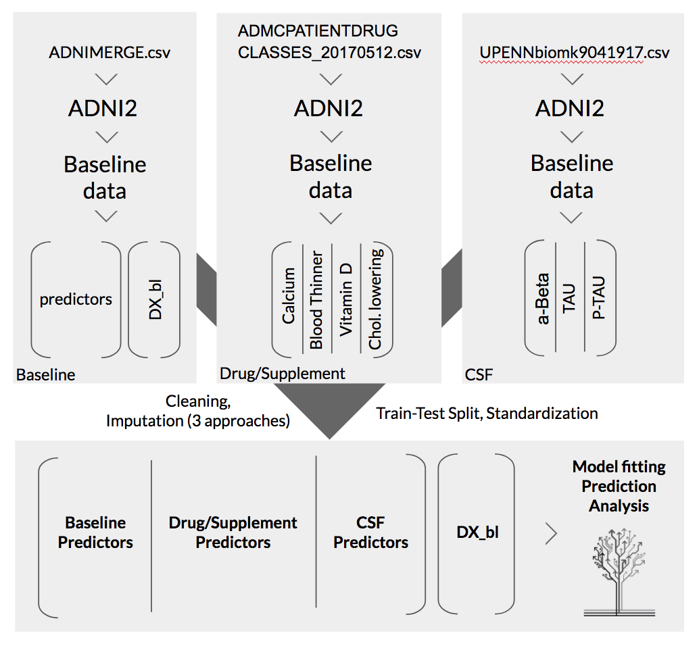

## Improving Diagnosis/Prognosis Accuracy in Alzheimer’s Disease Patients: Drugs, Supplements, and Tau Protein Levels Are Important Predictors

Final Project Report for AC209a - Introduction to Data Science

Official Group #46: Carlo Amadei, Hsiang Hsu, Rebecca Stern, Thomas Hsueh

### TODO1: Table of Content ? perhaps followed by a border line
### TODO2: References - appended after each section so that reader will have to at least gloss over?

### 1. Problem Statement and Motivation
Alzheimer’s Disease (AD) is a degenerative brain disease and the most common cause of dementia, and AD rates are increasing annually. As of 2006, the global prevalence of AD was 26.6 million, and this figure is expected to increase four-fold by 2050. In the United States in 2016, AD was the sixth leading cause of death. From 2000-2013, deaths from AD increased 71% – this rise was larger than the increase in deaths from stroke (+23%) and heart disease (+14%) during the same time period.
<br /><br />

Given the debilitating nature of AD, the widespread and rising prevalence of this disease, and the increasing lifespan of human population, efforts to mitigate the incidence and damaged caused by AD in the future are imperative. A crucial step toward achieving this end is to understand the risk factors associated with AD. However, such predictive features are currently not well constrained. According to the U.S. 2017 Alzheimer’s Disease Facts and Figures:

```markdown
“Although the research that followed has revealed a great deal about Alzheimer’s, much is 
yet to be discovered about the precise biological changes that cause the disease, why it 
progresses more quickly in some than in others, and how the disease can be prevented, 
slowed or stopped.”  
```

The clinical challenge in diagnosing AD arises because early forms of the disease do not present motor, sensory, or coordination deficits, and laboratory tests are not determinative. In addition, Mild Cognitive Impairment (MCI) is associated with AD, but more research is needed to improve accuracy of diagnostics that distinguish between amnestic MCI and prodromal AD. Methods that improve accurate identification of early forms of AD, which do not present with cognitive symptoms, are an important component of clinical and research efforts to better characterize the causes and risks associated with this devastating progressive disease.
<br /><br />

Machine learning algorithms and statistical modeling offer a potential solution to offset the challenge in diagnosing early AD: by leveraging multiple data sources and combining information on neuropsychological, genetic, and biomarker indicators, among others, statistical models are a promising tool to enhance clinical detection of early AD. In this report, we optimize a predictive models for diagnosis of CN, MCI, and AD using a set of baseline features, and we improve the baseline feature set by considering additional variables. Specifically, we investigate the relationship between AD diagnosis and taking certain medications (e.g., Calcium supplements, Vitamin D supplements, blood-thinning medications, cholesterol-lowering drugs). We also evaluate the importance of two cerebrospinal fluid (CSF) biomarkers, total tau (tau) and amyloid-Beta (Aβ), in diagnosing AD, as the relative role of these two biomarkers in AD remains a contentious issue in the academic community.,
<br /><br />

We hypothesize that the diagnosis of early AD can be improved by considering features related to whether a patient takes certain medications (calcium, vitamin D, blood thinners, and cholesterol-lowering drugs), and that tau is a stronger predictor than Aβ for AD diagnosis. The modeling approach we design could serve as a tool for clinicians to improve diagnosis of AD, as well as a springboard for future research related to AD and other neurodegenerative diseases. We contacted Dr. Sally Temple – a renowned neuroscientist specializing in neurodegenerative disease and co-founder of the Regenerative Research Foundation – who provided insights in direct communication: “It is essential to improve identification of signs of AD onset, because as drugs are developed, early intervention will be an important treatment goal.” 
<br /><br />
 

### 2. INTRODUCTION AND DESCRIPTION OF THE DATA 
We acquired our dataset from the Alzheimer’s Disease Neuroimaging Initiative (ADNI). The baseline statistical model that we develop is constructed using the ADNIMERGE.csv dataset from ADNI, which contains select variables related to clinical, genetic, neuropsychological and imaging results for the participants in ADNI. All phases of ADNI are represented in ADNIMERGE (e.g., ADNI1, ADNI2, ADNIGO). To maintain consistency across our analyses and manageability of the data, and to ensure that we can select only one observation for each patient effectively, we select only the patients who participated in the ADNI2 phase of the Initiative, representing a cohort size of approximately 800 patients. In the ADNI2 observations, each row corresponds to an exam of a patient (“RID”, the patient identifier), and specific visit; multiple rows can refer to the same patient for different visits. A thorough description of the ADNI cohort demographics is available online; in brief, the ADNI2 participants within ADNIMERGE.csv are from North America, aged 55-90, and ethnicities are represented in the study. The visit code column (VISCODE) allows us to identify baseline visit (‘bl’) predictors and predictors that refer to later visits. There are 94 columns in the baseline dataset, the majority of which correspond to independent variables that could be assessed at each exam.
<br /><br />

There are two diagnosis features, DX and DX_bl, which correspond to diagnosis at each visit and at a patient’s first visit, or baseline visit. All diagnoses entries correspond to one of five categories: Cognitively Normal (CN), Significant Subjective Memory Concern (SMC), Early Mildly Cognitively Impaired (EMCI), Late Mildly Cognitively Impaired (LMCI, or classic MCI), and Alzheimer’s Disease (AD). We combine the EMCI and LMCI diagnostic classes into a single class, Mild Cognitive Impairment (MCI); an auxiliary benefit of doing this is it facilitates the extension of our model for future analyses that might include ADNI1 data, which employs only a single MCI category. We combine CN and SMC into one category, as SMC patients qualify as being “cognitively normal,” as illustrated below. For detailed treatment on our handling of the diagnosis feature as a response variable, please see the discussion in Section 4 titled, “Choice of Response Variable.”
<br /><br />

<p align="center">
  
</p>

#### Supplemental features added to the baseline data
In addition to the ADNI2 entries within ADNIMERGE.csv, we incorporate two additional datsets:

1. Data on patients’ medications using the ADNI dataset - ADMCPATIENTDRUGCLASSES_20170512.csv and ???. We construct four new features, or predictors, for AD diagnosis that are comprised of components within the drug dataset and grouped into four main categories: calcium supplements, vitamin D supplements, blood-thinning drugs, and cholesterol-lowering drugs. Importantly, taking any of these medications does not disqualify a patient from participating as part of the ADNI cohort. For a complete list of specific drug and supplement names, please see Appendix F.

2. Data on patients’ cerebrospinal fluid (CSF) levels of amyloid-Beta (Aβ) and tau (TAU and P-TAU).  The ADNI dataset used to incorporate this biomarker data was produced by the University of Pennsylvania and available publicly on the ADNI website as “UPENNbiomk9041917.csv”

For both cases, we selected only the entries that correspond to ADNI2. From this, we constructed features columns that include the patient ID (RID), visit code (VISCODE==‘bl’), Retaining RID and VISCODE allowed us to merge the drug dataset with the preexisting model dataset based off of ADNIMERGE.csv. We did not include any other observation-identifying information (e.g., EXAMDATE, SITE) or other predictors. A flowchart illustrating the aforementioned dataset selection and integration is provided below:
<br /><br />

<p align="center">
  
</p>
<br /><br />

### 3. LITERATURE REVIEW/RELATED WORK
Research has attempted to augment these combined diagnostic tools with information about patients’ dietary and medical history. One studied found that Vitamin K antagonists increase cognitive impairment. Similarly, some efforts have focused on the role of diuretics and nutritional supplements in developing dementia. One publication using ADNI data found an association between non-steroidal anti-inflammatory drugs (NSAIDs) and improved cognition. Another paper presented trends in the ADNI dataset with respect to medications used to treat AD. Other studies have addressed the role of nutritional interventions (vitamin B12, B6, and E; omega-3 fatty acids; flavanol) and non-specific pharmacological interventions (NSAIDs, hormone-replacement therapy, Ginkgo biloba). In addition, three studies assessed the relationship between blood-thinners and AD, but none of these used the ADNI dataset.,, According to Galvin (2012), “Combination of interventions, such as non-pharmacologic treatments, pharmacotherapy, and medical foods, with complementary mechanisms of action may provide a rational approach that may result in maximum preservation of cognitive function in patients with AD.” Despite the promising nature of improving diagnostic accuracy of AD using medication features, few studies using ADNI have considered the medications that we investigate: calcium and vitamin D supplements, blood-thinning drugs, and cholesterol-lowering drugs.
<br /><br />

In addition, we also explore the the association of CSF biomarkers t-tau and Aβ with AD diagnosis. Both tau and AB accumulation in the brain reflect measurements of accumulation of peptides in the brain (in tangles inside neurons and plaques outside neurons, respectively) which lead to cognitive decline and are hallmark indicators of AD.,, Previous studies have focused on another CSF biomarker, Aβ, which is hailed as a “cardinal” feature of the disease. This led to therapies targeting the mechanisms of clearance and production of Aβ., However, research has indicated that an intracellular peptide – tau – may also play a significant role. Recent studies addressing the “amyloid-tau debate” suggest that perhaps tau is the true driver of AD symptoms. Approaches to modulate tau filament aggregation are beginning in clinical evaluation. Greater analytical representation of the relationship between tau and AD could bolster support for these nascent efforts and increase momentum in the clinical community toward developing therapeutic tools to address abnormal tau aggregation. As a contribution to this effort, in our model we compare the relative importance of t-tau and Aβ for accurate diagnosis of AD.
<br /><br />

With respect to statistical models to relate clinical and environmental features that predict early diagnosis of the disease, numerous studies have been published that use the ADNI database to generate predictive models for the diagnosis and prognosis of AD. Statistical analyses using the ADNI database have established that both biomarkers as strong predictors of AD, however, few studies have explicitly addressed the relative importance of t-tau and Aβ in absolute terms (i.e., excluding the temporal evolution of levels in progression of AD):
1. One study explored the role of Aβ and tau proteins in the conversion from MCI to AD, however the methods involved removing predictors that contain missing values. It is hoped that our model with more elaborate imputation methods could improve upon this previous work.

2. Another study explored the impact of CSF p-tau levels in the progression rate of AD, where only stepwise discriminant analysis is used for statistical analysis of predictor covariance. Our model uses a wide range of statistical models and examines three different CSF tau peptides levels (p-tau, t-tau, and Aβ) so hopefully we are able to provide a more thorough examination of the relationship between CSF peptide levels and AD diagnosis.

3. Yet another study performed the largest genome-wide association study (GWAS) of CSF tau levels published before 2013, where three novel genome-wide significant loci for CSF tau and p-tau were identified that show strong association with risk for AD. Linear regression was used for modeling single nucleotide polymorphism (SNP) for association with CSF biomarker levels. Without the expert knowledge in neuroscience and genetic analysis, It is our hope to use more complex predictive modeling techniques to unravel the association of CSF protein levels with risk/diagnosis of AD in the same ADNI dataset without delving into genetic analysis, which has a potential benefit of achieving a simpler yet powerful approach for AD diagnosis.
<br /><br />

### 4. MODELING APPROACH AND PROJECT TRAJECTORY 

#### Overview of Project Trajectory

#### Overview of Modeling Tools
We examined 17 different statistical models to select the optimal algorithm for predicting AD at baseline. All models used were derived from scikit-learn (sklearn) packages and executed in Python. Our data exploration, modeling approach, and progressive improvements to the baseline model are detailed next. Some caveats and limitations of our approach are mentioned directly in the text that follows; a more detailed examination of these conditions is provided in Appendix G.
<br /><br />
[FIGURE HERE]

#### Choice of Response Variable


### Reference

1. Loewenstein D, et al. Relative frequencies of Alzheimer’s disease, Lewy body, vascular and frontotemporal dementia, and hippocampal sclerosis in the State of Florida Brain Bank. Alzheimer Dis Assoc Disord 2002;16(4):203-12
2. Brookmeyer, R., Johnson, E., Ziegler-Graham, K., & Arrighi, H. M. (2007). Forecasting the global burden of Alzheimer’s disease. Alzheimer's & dementia, 3(3), 186-191.
3. Alzheimer's Association. (2016). 2016 Alzheimer's disease facts and figures. Alzheimer's & Dementia, 12(4), 459-509.
4. Annweiler, C., Ferland, G., Barberger-Gateau, P., Brangier, A., Rolland, Y., & Beauchet, O. (2014). Vitamin K antagonists and cognitive impairment: results from a cross-sectional pilot study among geriatric patients. Journals of Gerontology Series A: Biomedical Sciences and Medical Sciences, 70(1), 97-101.
5. DeBusk, R. M. (2000). Dietary supplements and cardiovascular disease. Current atherosclerosis reports, 2(6), 508-514.
6. https://adni.loni.usc.edu/wp-content/uploads/2008/07/adni2-procedures-manual.pdf
7. http://www.adni-info.org/Scientists/doc/ADNI2_Protocol_A3_17Oct2014_CLEAN.pdf
8. https://www.ncbi.nlm.nih.gov/pmc/articles/PMC3345787/


### ==================================================================
### ==================================================================

You can use the [editor on GitHub](https://github.com/hchsueh/AC209/edit/master/README.md) to maintain and preview the content for your website in Markdown files.

Whenever you commit to this repository, GitHub Pages will run [Jekyll](https://jekyllrb.com/) to rebuild the pages in your site, from the content in your Markdown files.

### Markdown

Markdown is a lightweight and easy-to-use syntax for styling your writing. It includes conventions for

```markdown
Syntax highlighted code block

# Header 1
## Header 2
### Header 3

- Bulleted
- List

1. Numbered
2. List

**Bold** and _Italic_ and `Code` text

[Link](url) and 
```

For more details see [GitHub Flavored Markdown](https://guides.github.com/features/mastering-markdown/).

### Jekyll Themes

Your Pages site will use the layout and styles from the Jekyll theme you have selected in your [repository settings](https://github.com/hchsueh/AC209/settings). The name of this theme is saved in the Jekyll `_config.yml` configuration file.

### Support or Contact

Having trouble with Pages? Check out our [documentation](https://help.github.com/categories/github-pages-basics/) or [contact support](https://github.com/contact) and we’ll help you sort it out.
